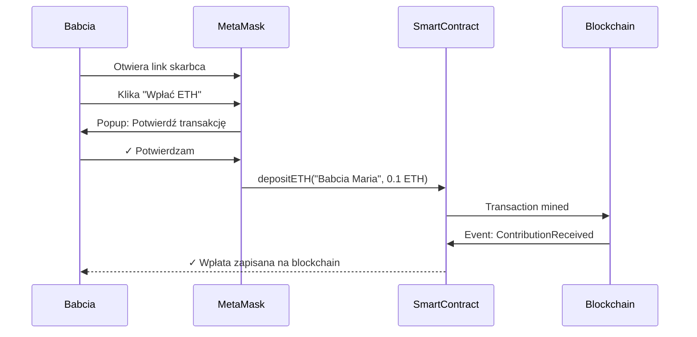
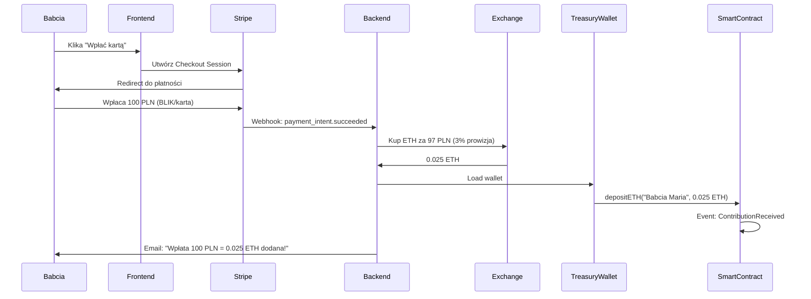
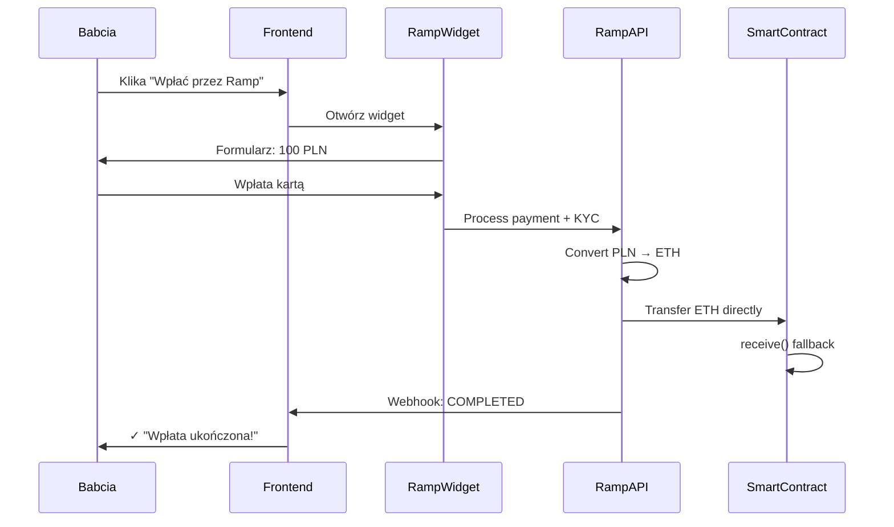
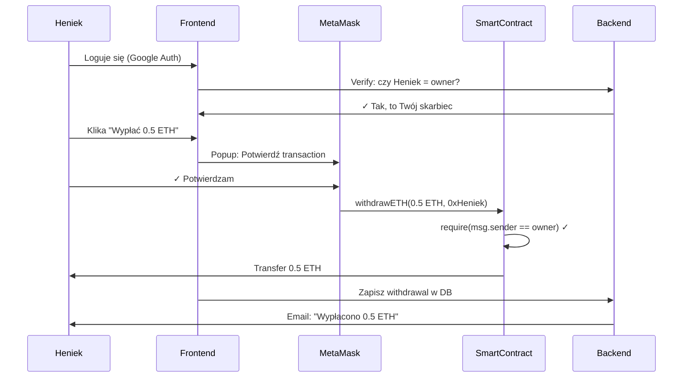

# 💳 Payment Flow Diagrams

## Flow 1: Wpłata przez MetaMask (Self-Custody)

**Zalety**: Zero prowizji (tylko gas), instant, self-custody
**Wady**: Wymaga MetaMask i ETH

---

## Flow 2: Wpłata przez Stripe (Custodial)

**Zalety**: UX jak zwykła aplikacja, no crypto needed
**Wady**: Prowizja 3%, custodial (my kupujemy ETH), regulatory risk

---

## Flow 3: Wpłata przez Ramp Network (Non-Custodial)

**Zalety**: Non-custodial (Ramp sends directly), compliance handled by Ramp
**Wady**: Prowizja 0.49-2.9%, wymaga KYC dla dużych kwot

---

## Flow 4: Wypłata przez Owner (Self-Custody Only!)

**Bezpieczeństwo**: TYLKO owner (Heniek z kluczem prywatnym) może wypłacić!
**Backend**: NIE MA dostępu do wypłat, tylko zapisuje do DB dla historii

---

## Porównanie metod

| Metoda | Prowizja | Czas | KYC? | Custody | Dla kogo? |
|--------|----------|------|------|---------|-----------|
| **MetaMask** | ~$0.01 (gas) | 2s | Nie | Self | Crypto users |
| **Stripe** | 2.9% + 1 PLN | 1-5 min | Nie | Custodial | Babcie/wujki |
| **Ramp** | 0.49-2.9% | 1-10 min | Tak (>150 EUR) | Non-custodial | No-coiners |

---

## Kluczowe decyzje architektury

### ✅ REKOMENDACJE:

1. **Start z MetaMask + Stripe**
   - MetaMask dla crypto users (Heniek)
   - Stripe dla rodziny (Babcia Maria)
   - Ramp dodaj później (Phase 3)

2. **Custody Model: Hybrid**
   - Owner (Heniek) ma klucz → self-custody dla wypłat ✅
   - Backend ma treasury wallet → relay dla wpłat Stripe ⚠️
   - Backend NIE MA dostępu do wypłat ✅

3. **Bezpieczeństwo Backend Wallet**
   - Private key w AWS Secrets Manager
   - Rate limiting: max 1 tx/min
   - Monitoring: alert jeśli balance < 0.01 ETH
   - Max amount: 1000 PLN per transaction

4. **Stripe → ETH Conversion**
   - Option A: Use exchange API (Binance/Kraken) - trudniejsze KYC
   - Option B: Use stablecoin DEX (Uniswap) - prostsze, on-chain
   - Option C: Partner z Ramp for backend - easiest

   **Recommendation**: Option C (partner with Ramp for business API)

---

## FAQ

**Q: Czy backend może ukraść środki?**
A: NIE. Backend może tylko DODAĆ środki do skarbca (wpłaty). Tylko owner z kluczem prywatnym może wypłacić.

**Q: Co jeśli backend się zhackuje?**
A: Worst case: hacker może zrobić wpłaty do skarbców (gift dla users 😄). Nie może wypłacić.

**Q: Czy trzeba KYC/AML?**
A: Zależy. Jeśli Stripe < 15k EUR/rok, prawdopodobnie nie. Ale lepiej skonsultować z prawnikiem.

**Q: Czy to legalne w Polsce?**
A: Tak, ale potrzebujesz:
- Działalność gospodarcza (JDG/Sp. z o.o.)
- Privacy Policy (GDPR)
- Terms of Service
- Disclaimer: "Not financial advice"

**Q: Ile kosztuje infrastruktura?**
A: MVP:
- Vercel: $0 (hobby) / $20/mo (pro)
- Supabase: $0 (500MB) / $25/mo (8GB)
- Stripe: $0 + 2.9% per transaction
- Domain: ~$10/year
- **Total**: ~$0-50/mo MVP, ~$100/mo production

---

Made with ❤️ for Skarbiec Dziecka
